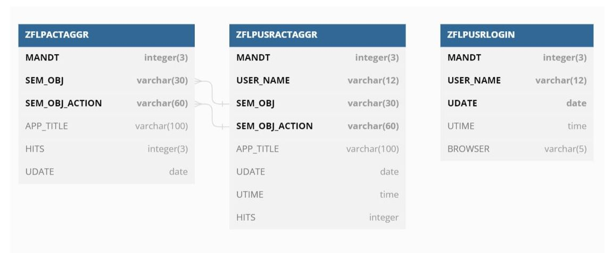

# Important Notice
This public repository and an open source project and we look forward for all of you to make use of it and come forward for improvements/feedback and features.

# SAP Fiori: Appliaction Tracker Overview Page
This is part one of "Fiori tiles usage and User monitoring for SAP Fiori launchpad (Monitoring SAP Fiori Launchpad)"

## Introduction 
For any application or product monitoring and usage statistics is undoubtedly one of very demanded and most helpful when it comes to evaluate any planning to be done or decisions to be taken.

A detailed background has been mentioned in [SAP Blog](https://blogs.sap.com/?p=1416621) 

## Target Audience 
This document is for whom has the experience of SAPUI5 along with ABAP OData service development

## Implementation Steps
### Database tables
- ZFLPACTAGGR: FLP Tracker App activity aggregated data
- ZFLPUSRACTAGGR: FLP Tracker user activity aggregated data
- ZFLPUSRLOGIN: FLP Tracker user login data

### Launchpad Plugin App
Fiori launchpad plugin to run my tracking script. Custom Odata service to post user tracking logs. Table to store the logs.
Component.js consists of :
- User login 
- Subscribe Events

#### User Login
- With "sap.ui.Device.browser" get browser being used by end user
- Call "userLoginSet" entity of OData ZFLP_TRACKER_SRV

#### Subscribe Events
- Use Web APIs Windows hashchange event which will help us to monitor the target mapping changes.
- Use FLP API sap.ushell.services.LaunchPage (ondemand.com) to get user’s tiles & groups & catalogs.
- Call "userActivitySet" entity of OData ZFLP_TRACKER_SRV

### OData Service
- ZFLP_TRACKER_SRV

